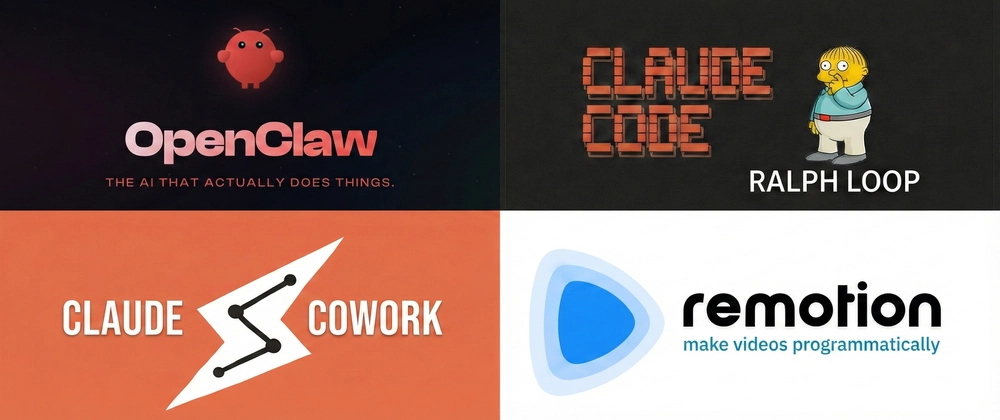
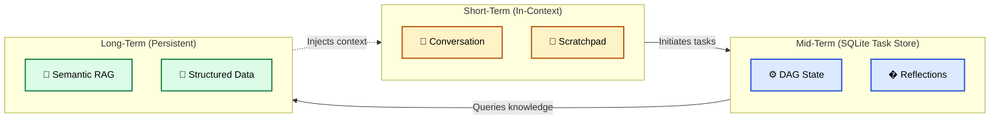
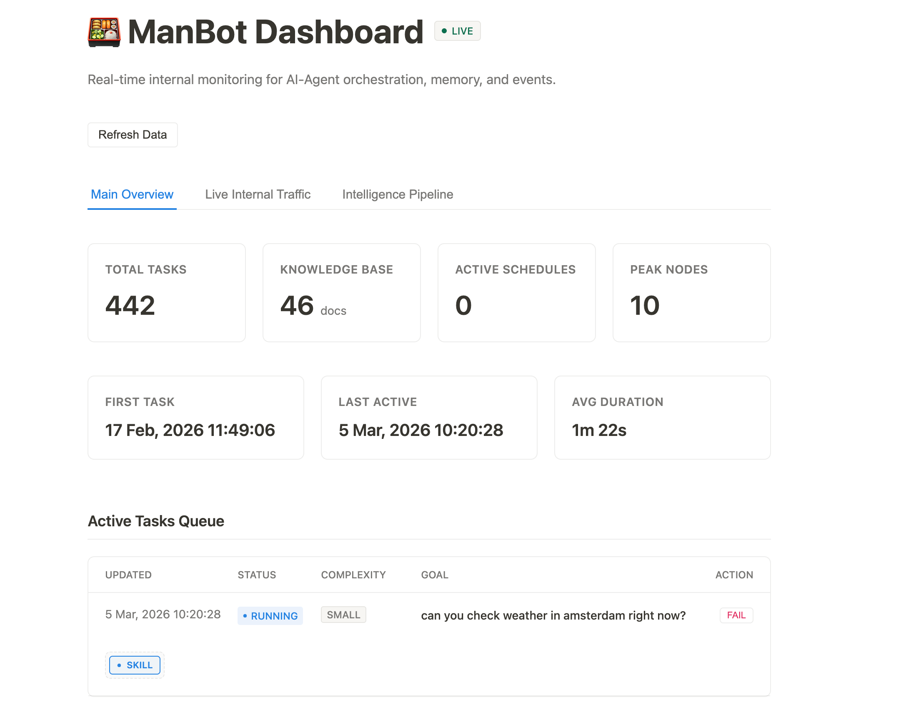

# I built my own AI-agent. Why?
**A journey from reading about AI to building a custom agent framework**


---
layout: image-left
image: ./_images/Gemini_Generated_Image_x6y0h0x6y0h0x6y0.png
---

## Mikhail Larchanka
- Principal Software Engineer at **Sytac**
- https://larchanka.com
- https://youtube.com/@larchanka
- https://github.com/larchanka
- https://x.com/mlarchanka

---

## 🌍 The AI Catch-Up
- The AI landscape is evolving at breakneck speed every single day.
- New models, new frameworks (LangChain, AutoGen), new methodologies.
- It feels like the revolution is passing by.
- **The Challenge:** I do not work with AI in my daily job. Staying actively involved requires intentional effort beyond standard day-to-day tasks.



---
layout: image-right
image: ./_images/Gemini_Generated_Image_vu2lluvu2lluvu2l.png
---

## 📚 The Trap of "Reading vs. Doing"
- I read a lot of papers, articles, and documentation.
- **The Reality Check:** Reading builds awareness, but not genuine *knowledge* or intuition.
- Without hands-on practice, you don't discover the edge cases, the latency issues, or the prompt fragility.
- I spent time checking what others were building in the space, and understanding their pain points.

---
layout: image-right
image: ./_images/dontlike.png
backgroundSize: contain
---
## 💡 The Catalyst: My Own Ideas
- While observing existing solutions, I realized I had different ideas on how agents should operate.
- Existing frameworks often felt either too bloated, too confusing, or too rigid.
- I wanted to build something tailored to my intuition of how a system should reason and interact with an environment.


---
layout: image-right
image: ./_images/ai-prices.png
backgroundSize: contain
---
## 💸 Cost-Driven Architecture
- **The Goal:** Make learning and relentless experimentation "cheap."
- Relying on cloud APIs (GPT-4, Claude) for agentic loops—which run autonomously making dozens of calls and mistakes—gets expensive quickly.
- **The Solution:** Local LLMs.
- Complete freedom to experiment, fail, retry, and loop infinitely without worrying about API bills.

---
layout: image-left
image: ./_images/llm-inference.webp
backgroundSize: contain
---

## 🤖 Evaluating Local LLMs
- Not all models are created equal for agentic tasks.
- **Benchmarking for my agent:**
  - Need strong coding and reasoning capabilities.
  - Need reliable JSON/tool-calling formatting.
  - Need fast inference speed (tokens/sec) for autonomous, multi-step loops.
- Explored running models locally using tools like Lemonade.
- Tested how models handle context degradation on local machine hardware.

---

## 🔀 Dynamic Model Routing
- Running a massive model (like Mixtral) for every tiny task is slow and overkill.
- I built a **Model Router** that dynamically selects models based on task complexity.
- **The Flow:**
  1. **Planner:** Evaluates the user's intent and forces the plan into a `complexity` bucket (`"small"`, `"medium"`, or `"large"`).
  2. **Injection:** The Executor injects `_complexity` into the payload for every node.
  3. **Router Resolution:** The `GeneratorService` checks the complexity and maps it purely via `config.json`.
  4. *Small -> Llama3:8B (Fast system loops)* | *Medium -> Qwen2.5 (Standard)* | *Large -> Mixtral (Deep research)*.

---

## 🛡️ Context & Token Safety
- I didn't want to calculate exact tokens with heavy libraries (like `tiktoken`) on every single loop.
- **My Strategy (Heuristics & Compression):**
  - **Safety Truncation:** If a tool (like a massive `http_get` web scrape) returns over 30,000 characters, the `ExecutorAgent` aggressively truncates it.
  - **Prompt Summarization:** Instead of keeping an infinitely growing chat history, the Planner produces a `summarize` node using a specialized `SUMMARIZER_SYSTEM_PROMPT` to compress old context dynamically.
  - Tracking the standard `usage` vectors from OpenAI-compatible tools (`prompt_tokens`, `total_tokens`) for observability rather than strict hard-blocking.

---

## 🏗️ The Ultimate Testing Playground
- The framework wasn't just a final product; it was a testbed.
- **Objectives:**
  - Test how to actually *code* with agents in different structural scenarios.
  - Experiment with system architecture and modularity design.
  - Learn how to construct proper, dynamic task-planning prompts.
  - Create functional applications autonomously based on structured tasks.
<br />
<br />
<br />


---

## ⚙️ The Core Loop: Solving Communication
- **The Problem:** LLMs naturally output raw text. Agents need structured, executable actions.
- **The Implementation:** 
  - Forcing the local LLM to output valid JSON representations of tool calls.
  - Handling parsing errors seamlessly through self-correction loops.
  - Designing a robust schema that the LLM understands and adheres to.
  - Distinguishing between "Thinking" (reasoning) and "Acting" (tool execution).

---

## ⚙️ The Core Loop: Solving Communication

### Request

```
{
  "id": "uuid",
  "from": "core",
  "to": "planner",
  "type": "plan.create",
  "version": "1.0",
  "timestamp": 1704067200000,
  "payload": {}
}
```


---

## ⚙️ The Core Loop: Solving Communication

### Response

```
{
  "id": "same-as-request",
  "from": "planner",
  "to": "core",
  "type": "response",
  "version": "1.0",
  "timestamp": 1704067200000,
  "payload": {
    "status": "success",
    "result": {}
  }
}
```

---
layout: image
image: ./_images/SCR-20260305-jmkx.png
---


---

## 🛠️ Equipping the Agent: Tools & Skills
- Agents are useless without hands.
- I built a modular tool host system.
- Standardized interfaces for tools: `name`, `description`, `parameters`, `execute()`.
- Grouping tools into highly specialized "Skills" (e.g., File System, Terminal, Browser).
- Optimization: Injecting only relevant tool schemas into the prompt to preserve context.


---
layout: image
image: ./_images/SCR-20260305-jmme.png
---


---

## 🔌 Standardizing with MCP
- **Building MCP (Model Context Protocol) Integration:**
- Why reinvent the wheel for every custom tool or data source?
- Implementing MCP allowed my agent to connect to external, standardized tools seamlessly.
- Learned how to expose local environment capabilities (files, API connections) to an agent through standardized, secure boundaries.

---

## 🏛️ The Layered Memory Architecture
To prevent context contamination and keep prompt sizes manageable, I separated memory into distinct tiers:



---

## 🕒 When is each memory used?

- **Short-Term (Conversation & Session):**
  - **When:** Active chatting, holding the immediate goal, fast active reasoning. 
  - **Lifecycle:** Evicted rapidly to save prompt context.
- **Mid-Term (Task Memory & State - SQLite):**
  - **When:** Tracking multi-step execution graphs (DAGs), pausing/resuming tasks, storing critic reflections & retry counts.
  - **Lifecycle:** Persists across agent loops; prevents the agent from getting stuck in circles.
- **Long-Term (Vector DB & File System):**
  - **When:** Finding unseen documents or entire codebase structures based on semantic meaning.
  - **Lifecycle:** Permanent; grows over time.

---

## 🧠 Long-Term Memory: RAG from Scratch
- Local LLMs have finite (and hardware-bound) context windows.
- You can't simply fit an entire large codebase into a localized 8k context window.
- **Building RAG (Retrieval-Augmented Generation):**
  - Used `sqlite-vss` for K-Nearest Neighbors (KNN) vector search natively inside SQLite.
  - Implementing fallback to dot-product calculations if the VSS extension is unavailable.
  - Generating and storing embeddings locally to retrieve only the relevant functions immediately needed.
<br /><br /><br />


---

## ⚖️ Mastering Context Window Management
- **The hardest technical challenge:** Managing prompt size dynamically.
- Combining RAG retrieval with the agent's conversational history.
- Implementing mechanics to handle max-tokens:
  - Sliding windows for conversation history.
  - Context summarization.
  - Deciding what to precisely evict from memory without making the agent "forget" its core objective.

---

## 📊 Dashboard



---

## 🚀 The Result: Bridging Theory and Practice
- I built an entire development framework myself from the ground up.
- Moved from passive reading about AI architectures to actively solving their core engineering constraints.
- Built a system based entirely on my own ideas, uniquely tailored to my development flow.
- Resulted in a fully functional, cost-free, local agentic framework.

---
layout: image-right
image: ./_images/Gemini_Generated_Image_x6y0h0x6y0h0x6y0.png
---

## Thank You!
**Questions & Discussion**

https://manbothq.github.io/
